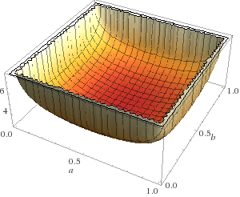

## unlp

> Unrestricted Non-linear programming assignment at @ UFRJ

*Objective:* Implement the Gradient, Newton and Quasi Newton methods to solve the optimization problem. All the methods should use the armijo rule to calculate the steps and BFGS to update the Hessian.

### Analysis of Function A

1. We restricted the function interval to a = ]0,1[ and b = ]0,1[ to avoid problems in complex domain.

2. For this function we are going to maximize (max = - min)

3. The critical point is a = 0.5 and b = 0.5
4. The initial points (a, b) tested are: (0.1,0.9), (0.5, 0.1), e (0.35, 0.45)

* For the a = 0.1 and b = 0.9

Method | Critical Point (X.) | Function at X. | Number of Iterations
------ | ------------------- | -------------- | --------------------
Gradient | (0.5, 0.5) | 2.77259 | 14
Newton | (0.5, 0.5) | 2.77259 | 6
Quasi-Newton | (0.490937,0.509063) | 2.77325 | 2

### Analysis of Function B

1. For this function the only condition is a real positive number.
2. The critical point is a = 1 and b = 1
4. The initial points (a, b) tested are: (0.35,0.45), (1.5, 0.5), and (1, 0.8)

* For the a = 1.5 and b = 0.5

Method | Critical Point (X.) | Function at X. | Number of Iterations
------ | ------------------- | -------------- | --------------------
Gradient | (1,1) | 0 | 15
Newton | (1,1) | 0 | 5
Quasi-Newton | (0.973201,1.04812) | 0.00294248 | 4